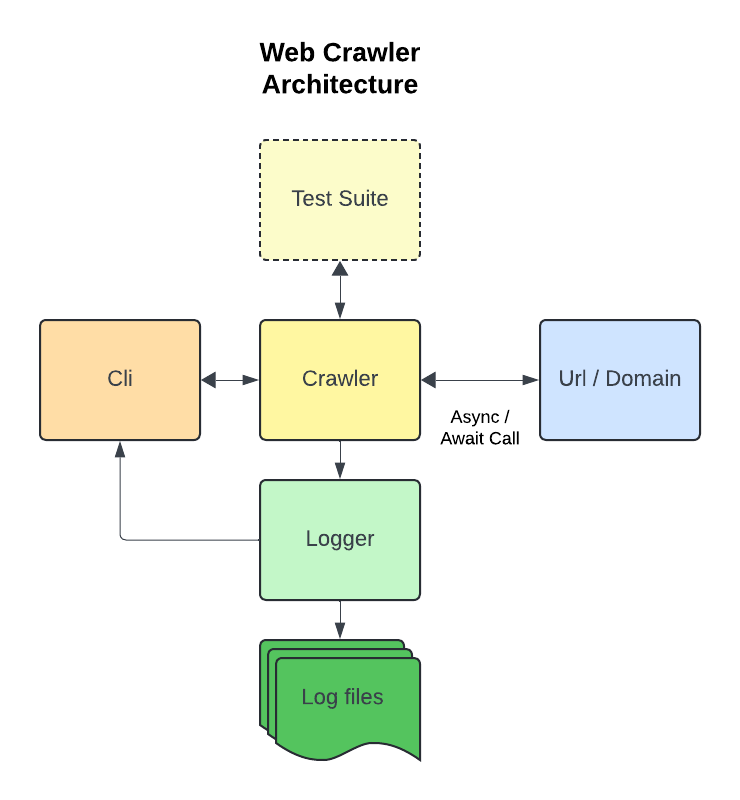

# Web Crawler

## Overview

This web crawler project is a simple command-line application that allows users to crawl web pages and collect links. The application supports depth-limited crawling, asyncronus requests, a command-line interface (CLI) for user interaction, and configurable options through a YAML file.

## Features

- **Crawling Capabilities**: Crawl from a specified starting URL and collect all valid links.
- **Depth Control**: Limit the depth of crawling to avoid overly deep traversals.
- **Asynchronous Concurrent Calls**: Has async functionality
- **Command-Line Interface**: Interactive CLI that allows selection of various crawling options. 
- **Configuration Management**: Ability to read starting URLs from a YAML configuration file.
- **Test Suite**: Unit tests to ensure the functionality of the crawler as well as additonal functionality.

## Project Architecture

See below a basic diagram of the arcitecture of the project



The logger is kept as a sperate model to enable more development in this area. For now we have basic time stamps and info on the machine which will be useful when deployed especially across multiple machines or nodes. 

## Repository structure

- cli:
  - cli.py: The main script for the command-line interface.

- crawler/: Contains core logic of the web crawler.
  - crawler-config.yml: A YAML configuration file containing settings and parameters for the web crawler.
  - crawler.py: The main module for the web crawler, implementing the crawling logic and managing URLs
  - crawler_utils.py: A utility module that contains helper functions used by the crawler.

- main.py: The entry point for the application

- testing/: Testing suite for the application.
    - test_cases/: This directory contains test cases for the web crawler.
        - test_cases.py: The main test suite that defines various test cases for the crawler.
        - test_base_crawl.html: An HTML file used as a sample input for testing the crawling functionality.

- test_crawler.py: A module that contains unit tests for the crawler.

## Installation and run

1. **Set up Docker**: Ensure you have Docker installed and running on your machine.

2. **Use make Build the Docker image and run the project**:
The project uses a Makefile with the following commands:

```make build``` - Builds the docker image

```make start-cli``` - Starts the cli which provides interaction with the crawler

```make test-server``` - Runs the test server which serves test web pages to local host

```make test``` - Runs the test crawler on local host and evaluates unit tests

```make clean``` - Runs docker-compose down and cleans volumes

## Configuration

The application uses a YAML configuration file called `crawler-config.yml`. This file allows users to define starting URLs for crawling. 

Loggin configs can be accessed via the cli.

### Example `crawler-config.yml`
```yaml
urls:
  - http://test-webserver:8000/test_site_1.html
  - http://example.com 
  ```

## Logging

The application incorporates a logging system that captures various events, errors, and information during crawling. Logs can be written to a file for future reference and troubleshooting.

### Testing

Test cases are defined in the /testing/test_cases.py file. To run the tests, execute the command make test in the terminal. This will evaluate unit tests to ensure the correctness of the crawler's functionality.

### Limitations and ideas for future development


**User Agent and HTTP Headers**
Currently, the crawler does not utilize any HTTP headers, user agents, or authentication. There is also no implementation of proxies or consideration for request timing. These features should be integrated in future iterations to interact with various websites effectively, especially those that implement anti-bot measures or require specific headers for access.

**Testing Enhancements**
The current testing suite covers basic functionality by testing the crawler's ability to make requests to simple web pages. Nex steps should expand the testing framework to include edge cases, error handling, and more complex site structures. Testing of the command-line interface (CLI) functionality is also essential to ensure that user inputs are correctly handled and that the user experience remains smooth.

**Enhanced logger**
The logger is setup in its own module to enable further development. Here a better logging library could be added or we could enchance the logging file write setup to handle very large crawl tasks. This could be combined with an analytics or filtering capability. 

**GitOps and Deployment Automation**
Here we could create YAML files for automated deployment pipelines, enabling CI/CD which allows crawler can be rolled out swiftly and reliably.

**Linting and Pre-Commit Hooks**
To maintain code quality and adhere to coding standards, the implementation of linting tools is recommended. Additionally, establishing pre-commit hooks will help enforce these standards before code is committed, reducing the likelihood of introducing errors or inconsistencies.